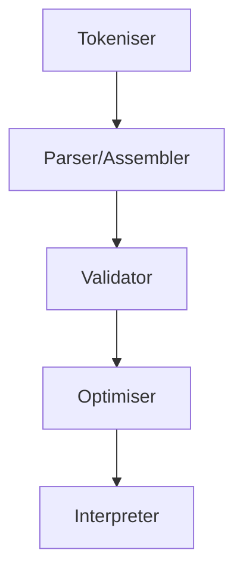
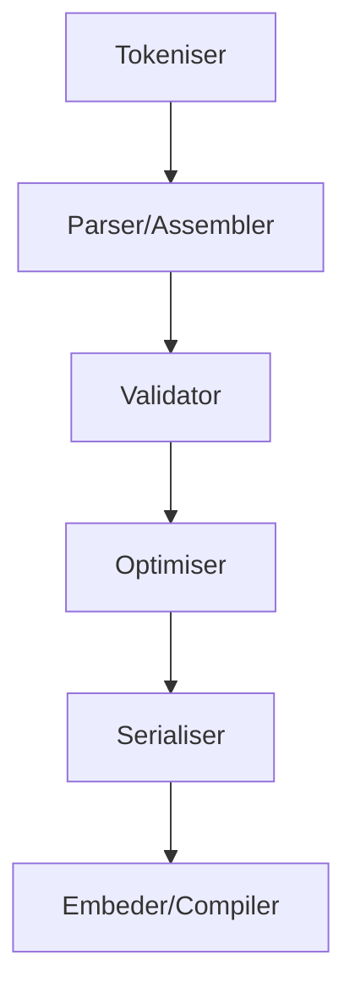

<div style="display:flex;align-items:center;gap:16px;">
  
  <div>
    <h1>The LIA Programming  Language v1.0.0 Specification [DRAFT]</h1>
    Revision: 4<br>
    Release Date: 30/8/2025<br>
    Author: Lawton "Lawtro" Kelly
  </div>
</div>


## Table of Contents

1. [Introduction](#introduction)
2. [Lexical Structure](#1-lexical-structure)
	- [Identifiers](#11-identifiers)
	- [Keywords](#12-keywords)
	- [Aliases](#aliases)
	- [Literals](#13-literals)
	- [Operators](#14-operators)
	- [Delimiters](#15-delimiters)
3. [Types](#2-types)
	- [Sub-type Aliases](#sub-type-aliases)
4. [Variables](#3-variables)
5. [Statements](#4-statements)
6. [Functions](#5-functions)
7. [Objects](#6-objects)
8. [Arrays](#7-arrays)
9. [Classes](#8-classes)
10. [Casting](#9-casting)
11. [Import System](#10-import-system)
12. [Memory Management](#11-memory-management)
	- [Memory Allocation Model](#101-memory-allocation-model)
13. [Runtime / Execution Model](#12-runtime--execution-model)
	- [Execution Model](#execution-model)
14. [Error Handling](#13-error-handling)
15. [Grammar (EBNF Approximation)](#14-grammar-ebnf-approximation)
16. [Operator Precedence](#15-operator-precedence-high--low)
17. [Native Interop](#16-native-interop)
18. [Native Functions (Built-ins)](#17-native-functions-built-ins)
19. [.AST Bytecode Format](#18-ast-bytecode-format)
	- [Headers](#181-headers)
	- [Instructions](#182-instructions)
	- [Types](#183-types)
	- [Literal Values](#184-literal-values)
20. [Implementation Recommendations](#19-implementation-recomendations)

This document describes the core language specifications and not particularly the current state of LIA-lang. This is simpley the target of what LIA-lang should be.

**THIS DOCUMENT IS INCOMPLETE:** more content is planed to be added to this document.

## Introduction
This specification defines the normative syntax, semantics, and external interface of the LIA programming language. Its goal is to provide a precise, implementation‑agnostic contract for:
- Lexical elements (tokens, literals, keywords)
- Grammar and syntactic forms
- Type system and coercion model
- Runtime constructs (functions, objects, arrays)
- Memory and lifetime directives (`free`)
- Module and external library importing
- Native interoperability surface

Scope: Only the core language and its required runtime behaviors.  
Non‑scope: Tooling, build systems, optimization strategies, debugging facilities, editor integration, and prospective future extensions.

Conformance: An implementation is conforming if it:
1. Accepts all grammatically valid programs defined herein.
2. Rejects (with a diagnostic) any lexically or syntactically invalid input.
3. Preserves the specified evaluation order and side‑effects.
4. Implements the defined type and value categories (including `null` and `void` semantics).

Undefined Behavior: Any construct not explicitly covered (e.g. accessing non‑existent object fields) is undefined and may terminate execution or produce implementation‑specific results.

Versioning: This draft targets v1.0.0. Backward incompatible changes after ratification require a major version increment.

Terminology:
- “Must” / “Shall”: mandatory.
- “Should”: recommended.
- “May”: optional.
- “Undefined”: intentionally unspecified—implementations are not required to diagnose.
- "LIA-lang: the LIA Programming  language

All examples are illustrative; if an example conflicts with a formal rule, the rule governs.

## 1. Lexical Structure
Character set: ASCII (string contents treated as raw bytes)  
Whitespace: space, tab, CR, LF (insignificant outside string literals)  
Comments: 
`//` to end of line  
`/*` to next `*/` comment closure

### 1.1 Identifiers
Pattern: `[A-Za-z_][A-Za-z0-9_]*`  
Case-sensitive. Reserved keywords excluded.

### 1.2 Keywords
`function, class, new, var, const, return, if, else, for, loop, while, break, skip, free, import, true, false, null, void, bool, int, float, string`

note that keywords and their ailes arent particularly reserved when defining variables

#### Aliases
`function`: `fn, fun, func, def`  
`var`: `let, local`  
`const`: `final`  
`break`: `stop`
`skip`: `continue, next`
`free`: `delete, pop`  
`null`: `nul`  
`bool`: `boolean`

### 1.3 Literals
- Integer: decimal digits (`123`).
- Float: digits with a decimal point (`1.0`, `0.5`).
- String: `"` until next `"` (new lines do not close stings).
- Boolean: `true` / `false`.
- Null: `null`.
- Object literal: `{ <type>? <identifier>: <value> (, <type>? <identifier>: <value>)*, }`.
- Array literal: `<type>? [element (, element)*]` (optional leading inline type token).

### 1.4 Operators
- Arithmetic: `+ - * /`
- Comparison: `==`
- Assignment: `=`
- Unary: prefix `+ -`
- Index: `ident[expression]`
- Member access: grammar placeholder exists but is not part of the active syntax; accessing object fields directly is not defined outside literal construction.

### 1.5 Delimiters
`() [] { } , :`

## 2. Types
Primitive core:
- `int<S>` / `uint<S>` (signed / unsigned integers by size)
- `float<S>`
- `string`
- `bool`
- `void` (function return type only)
- `null`
- `any` (internal fallback / inference default)

`S` = storage size in bytes; default size when omitted is 32 bits.
Default type size: 32 bits (e.g. `int` = `int32`).

### Sub‑type Aliases
Integers (signed / unsigned):
- 8:  `int8,  i8,  byte` / `uint8,  u8,  ubyte`
- 16: `int16, i16, short` / `uint16, u16, ushort`
- 32: `int32, i32` / `uint32, u32` (alias `int` = `int32`)
- 64: `int64, i64` / `uint64, u64`

Floats:
- 32: `float, float32, f32, number, num`
- 64: `float64, f64, double, real`

Strings: `string, str, text`

Composite:
- Arrays: dynamic length; literal syntax `[...]`.
- Objects: anonymous record literal `{ type name: value, ... }`.
- Functions: first‑class by identifier (no closures).

## 3. Variables
Syntax:
`var <type>? <name> (= expression)?`
`var <type>? <name>[index]?` (array element assignment after declaration uses assignment)
`const` modifier is parsed; enforcement of immutability is nominal.
`const <type>? <name> (= expression)?` (var can be infered)
`global var <type>? <name> (= expression)?`

Variables with no declared type defalt to `any`
Uninitialized variables get `null`.

## 4. Statements
- Expression statement
- `if (expr) { block } (else { block })?`
- `while (expr) { block }`
- `loop (num) { block }`
- `for for (init; condition; increment) { block }`
- `return expression`
- `free(identifier (, identifier)*)`
- `import "path.lia" | "lib.llb"`
- `break` (breaks out of loops)
- `skip` (skips current loop)

## 5. Functions
Syntax:
`function <return_type> <identifier>( <param_list>? ) { block }`

Parameters:
`<type> <identifier>` separated by commas.

Return:
`return <expression>` (void functions may return without an expression producing `null`).

No overloading or default parameters.

## 6. Objects
Literal:
`{ <type> <fieldName>: <expression>, ... }`
Element type is either explicitly defined or inferred as `Any`.

## 7. Arrays
Two forms:
- Indexed identifiers: `arr[i]`
- Literals: `<optionalLeadingType> [ elem1, elem2, ... ]`

Element type is either explicitly defined or inferred as `Any`.
Arrays are to be bounds checked.

## 8. Classes
`class <classname> (args?*) { block }`

The main code block acts as the constructor for classes in LIA-lang.
Anything defined in the scope of a class becomes acsessable from the class object.
Classes can be instantiated as so `new <classname> (args?*)`.

## 9. Casting
Prefix type token followed by a parenthesized expression: `<type> (expr)`

## 10. Import System

`import "<.lia/.llb/.dll path>" (as <identifier>)?`

`import "relative/or/absolute/path.lia"`  
- Loads and tokenizes file; AST is inlined (recursive parse).  

`import "library.llb"`
- loads a LIA-lang library.

`import "library.dll"`
- loads a dynamic link library

`import "library.lia" as lib`
- import content is placed in an object instead of global scope

Search path: relative to current working directory. No cycle detection.

## 11. Memory Management
Once a scope is exited the scope and its contents are removed and freed from memory.
The `free()` function removes the inputed variable from the scope and frees the memory.

### 10.1 Memory Allocation Model

#### Stack Allocation
- Primitive types (int, float, bool)
- Function parameters and local variables
- Automatically freed on scope exit

#### Heap Allocation  
- Dynamic arrays and strings
- Objects and complex data structures
- Subject to implementation-defined size limits

#### Allocation Behavior
| data type | alocation location |
| -------- | -------- |
| `int` | stack |
| `float` | stack |
| `bool` | stack |
| `null` | stack |
| `void` | stack |
| `string` (< 32 bytes) | stack |
| `string` (> 32 bytes) | heap |
| Arrays | heap |
| Objects | heap |
| Classes | heap |

## 12. Runtime / Execution Model
LIA-lang is an interpreted programing language meaning execution is handeled by a program that reads in the code and executes it based on its operation.
LIA uses a Tree‑walk interpreter that executes assembled LIA code.
LIA code is assembled into an abstract stynax tree and/or serialised into `.ast` file before execution or being bundeled with an interpreter.
Runtime interpreters are eather embeded into a compiled binary with assembled LIA bytecode or are seperate and read in `.ast` or `.lia` files for execution.
In the case of a seperate interpreter `.lia` files are parsed into unserialised `.ast` LIA bytecode before being executed
A seperate interpreter will deserialise `.ast` files before executing theem.
An embeded interpreter will deserialise the LIA bytecode appended to the end of its file after the `"LIA\xFF` header before executing it.

| Diagram of Direct Interpretation |
|------------------------|
| `Tokeniser --> Parser/Assembler --> Interpreter` |

### Execution Model

#### Direct Interpretation


#### Copilation



## 13. Error Handling
Categories:

| Category | Examples | Handling (Typical) |
| -------- | -------- | ------------------ |
| Lexical  | Invalid token | Abort parse; diagnostic emitted |
| Syntax   | Unexpected token / structure | Abort parse with location |
| Type     | Incompatible assignment | Diagnostic; may abort validation |
| Runtime (non‑fatal) | Missing library function | Report; attempt continue |
| Runtime (fatal) | Calling an undefined function | Terminate with error code |

Standard diagnostic format (illustrative):
```
<KIND>: <MESSAGE>
at <FILEPATH>:<LINE>
<OPTIONAL EXTRA CONTEXT>
```

Fatal runtime errors terminate the process with an implementation‑defined exit code. Non‑fatal runtime issues may be logged to stderr or console depending on runtime flags.

## 14. Grammar (EBNF Approximation)
```
program          ::= statement*
statement        ::= function_decl
				   | var_decl
				   | if_stmt
				   | while_stmt
				   | return_stmt
				   | free_stmt
				   | import_stmt
				   | expression
function_decl    ::= "function" type identifier "(" param_list? ")" block
param_list       ::= param ("," param)*
param            ::= type identifier
var_decl         ::= "var" ("const")? type identifier ("=" expression)?
if_stmt          ::= "if" "(" expression ")" block ("else" block)?
while_stmt       ::= "while" "(" expression ")" block
return_stmt      ::= "return" expression
free_stmt        ::= "free" "(" ident_or_index ("," ident_or_index)* ")"
import_stmt      ::= "import" string_literal
block            ::= "{" statement* "}"
expression       ::= assignment
assignment       ::= binary ("=" assignment)?
binary           ::= unary (op unary)*        # op in precedence order (* /, + -, ==)
unary            ::= ("+" | "-" | cast_prefix) unary | primary
cast_prefix      ::= type "("
primary          ::= number
				   | string_literal
				   | "true" | "false" | "null"
				   | identifier call_or_index?
				   | array_literal
				   | object_literal
				   | "(" expression ")"
call_or_index    ::= "(" arg_list? ")" | "[" expression "]"
arg_list         ::= expression ("," expression)*
array_literal    ::= "[" type? (expression ("," expression)*)? "]"
object_literal   ::= "{" object_field ("," object_field)* "}"
object_field     ::= type identifier ":" expression
ident_or_index   ::= identifier ("[" expression "]")?
type             ::= "int" size? | "uint" size? | "float" size? | "char" size? | "string" | "bool" | "void" | "any"
size             ::= integer_literal
```

## 15. Operator Precedence (High → Low)
1. Unary (`++ --`)
2. Multiplicative (`* /`)
3. Additive (`+ -`)
4. Equality (`==`)
5. Assignment (`=` right-associative)

## 16. Native Interop
#### `.dll` files:
.dll files can be loaded via `import` or the `loadLibrary()` native function
.dll public functions will be converted to work with LIA-lang placed in the global scope
#### `.llb` files:
.llb files can be loaded via `import` or the `loadLibrary()` native function and are esentualy librarys specificly made for LIA-lang.
.llb files are techincly just .dll files under the hood just with specal functionality to interface with LIA-lang

## 17. Native Functions (Built‑ins)
The following native (built‑in) global functions are provided by the reference interpreter. Availability or exact behavior may vary in other runtimes.

| Function | Args | Returns | Description |
| -------- | ---- | ------- | ----------- |
| `println` | `any*` | `void` | Prints each argument on its own line (stringifies values). |
| `print` | `any*` | `void` | Prints arguments without automatic newline separation. |
| `len` | `value` | `int` | Length of string / array / object field count. |
| `push` | `array` `item` `index?` | `void` | Appends an item to a specified or last item of an arry |
| `pop` | `array` `index?` | `void` | Removes the specified or last item of an array |
| `input` | (none) | `string` | Reads a line from standard input (newline trimmed). |
| `assert` | `bool` | `void` | Panics if argument is false. |
| `exit` | `int?` | (never) | Terminates process with optional integer code. |
| `ceil` | `number` | `int` | Ceiling of numeric argument. |
| `sin` | `number` | `float` | Sine (radians). |
| `cos` | `number` | `float` | Cosine (radians). |
| `tan` | `number` | `float` | Tangent (radians). |
| `log` | `base, value` | `float` | Logarithm of `value` to given `base`. |
| `exp` | `value` | `float` | e^value. |
| `random` | (none) | `float` | Pseudo‑random float in [0,1]. |
| `randomInt` | `min, max` | `int` | Pseudo‑random integer in inclusive range. |
| `sleep` | `ms` | `void` | Sleeps current thread for milliseconds. |
| `date` | (none) | `string` | Current date (YYYY‑MM‑DD) naive calculation. |
| `timestamp` | (none) | `int` | Milliseconds since Unix epoch. |
| `timestampSeconds` | (none) | `int` | Seconds since Unix epoch. |
| `loadLibrary` | `string` | `void` | Loads a .dll or .llb library. |

## 18. .AST Bytecode Format

### 18.1 Headers

| header | use |
| ------ | ------ |
| `LIA\xFF` | Indicates the start of AST bytecode when embeded into an executable. |
| `0xAB` | Magic number. |
| `0x01` | Version header (for future compatability) |

### 18.2 Instructions
| Tag | Instruction | Data Structure |
| --- | ----------- | ---- |
| `0x01` | `Program(instructions)` | `[number Of instructions][Instructions*]` |
| `0x02` | `Decloration(Identifier, Type, Value)` | `[Identifier][Type][Value]` |
| `0x03` | `Assignment(Identifier, Value)` | `[Identifier][Value]` |
| `0x04` | `If(condition, body, else_body)` | `[BinaryOp(condition)][Program(body)](else ? 1[Program(else_body)] : 0)` |
| `0x05` | `Function(Identifier, Type, args, body)` | `[Identifier][Type][length of args (as u32)][Argument(args)?*][Program(body)]` |
| `0x06` | `Argument(identifier, Type)` | `[string(identifier)][Type]` |
| `0x07` | `Call(identifier, args)` | `[string(identifier)][length of args (as u32)][Argument(args)?*]` |
| `0x08` | `Return(Value)` | `[Value]` |
| `0x09` | `BinaryOp(operation, left, right)` | `[string(operation)][AST(left)][AST(right)]` |
| `0x0A` | `UnaryOp(operation, Value)` | `[string(operation)][Value]` |
| `0x0B` | `Literal(Type, Value)` | `[Type][Value]` |
| `0x0C` | `Identifier(identifier, index)` | `[string(identifier)](index ? 1[AST(index)] : 0)` |
| `0x0D` | `Array(Type, items)` | `[Type][lenth of items (as u32)][Value(items)?*]` |
| `0x0E` | `Object(fields<Type, indentifiers, Value)` | `[length of fields]([Type][Identifier(indentifiers)][Value])?*` |
| `0x0F` | `While(condition, body)` | `[BinaryOp(condition)][Program(body)]` |
| `0x10` | `Free(Identifier)` | `[length of identifiers (as u32)][Identifier?*]` |
| `0x11` | `Class(Identifier, args, body)` | `[Identifier][length of args (as u32)][Argument(args)?*][Program(body)]` |
| `0x12` | `NewInstance(Identifier, args)` | `[Identifier][length of args (as u32)][Argument(args)?*]` |

### 18.3 Types
| Tag | Type | Data Structure |
| --- | ---- | -------------- |
| `0x01` | `Int(signed, size)` | `[signed (0/1 | u8)][size (u8)]` |
| `0x02` | `Float(size)` | `[size (u8)]` |
| `0x04` | `String` | NA |
| `0x05` | `Bool` | NA |
| `0x04` | `Void` | NA |
| `0x04` | `Null` | NA |
| `0x04` | `Any` | NA |
| `0x04` | `Class(identifier)` | `[String(identifier)]` |

### 18.4 Literal Values
| Type | Data Structure |
| ---- | -------------- |
| `Int(signed, size)` | `[<u/i><size>]` |
| `Float(size)` | `[f<size>]` |
| `Bool` | `[0/1]` |
| `String` | `[string length][string]` |

## 19. Implementation Recomendations
- Implementations of LIA-lang should be memory safe.

---
Status: Draft baseline for v1.0.0 core.
